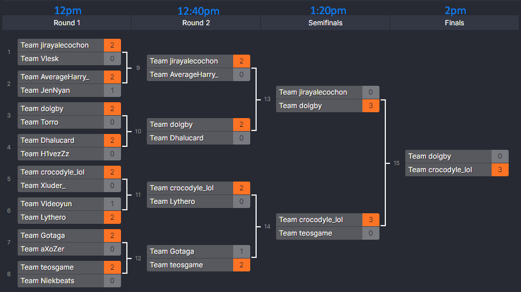

# Dinámica

El torneo se dividirá en rondas de 1vs1 por eliminación simple, comenzando el **sábado a las 12pm**. Dependiendo del número de participantes se definirá el número de rondas, entre cada una de ellas habrá una tolerancia de **40min**, esto quiere decir que en ese tiempo se deberá retar al oponente con las condiciones indicadas y resolver los problemas ya que la hora de inicio de la siguiente ronda no debe posponerse. Rondas de ejemplo:

## Plataformas 

El torneo se desarrolla en distintas plataformas:
* **Discord**: Canal `#-lockout` como medio de comunicación entre los participantes, organizadores y con el mismo bot.
* [**Challonge**](https://challonge.com/): Plataforma donde se encontrará el bracket y que llevará la actualización de las rondas con sus respectivos resultados. 
**Nota**: NO es necesario crear una cuenta aquí, podrán visualizarlo como espectadores.
* [**Codeforces**](https://codeforces.com/): Juez evaluador, de forma que en éste lugar se encontrará el set de problemas a resolver, y aquí mismo se harán los envíos al evaluador de código.

## Desarrollo de la ronda

1. La ronda puedes iniciarse en cuanto estén listos ambos participantes (aunque sea antes de la hora programada).
2. Escribe el comando `.round challenge <oponente>`.
3. El bot te pedirá configurar el round, usa las siguientes opciones:

|     Pregunta    |        Respuesta       |
|-----------------|------------------------|
| # Problemas     |            3           |
| Tiempo          |           20           |
| Dificultades    |      800 800 1000      |
| Puntuación      |       100 100 200      |
| Rotar problemas |            1           |
| Alias           | `<lista_alias>` / none |
| Ronda de torneo |            1           |
4. El bot publicará la lista de problemas, el primero que resuelva algún problemas se llevará la puntuación y el problema será cambiado por algún otro, no es necesario que vayan en orden, pueden verlos todos y resolverlos como les convenga.
5. ¡Resuelve los problemas rápido!
6. El bot automáticamente irá actualizando la ronda, estén al pendiente del discord para saber cuando los problemas ya no estén disponibles o cuando termine la ronda.
7. ¡Terminó la ronda!, toma un respiro, en caso de haber ganado revisa tu siguiente oponente en Challonge y repite el proceso de nuevo, en caso de que no, gracias por participar y sigue practicando para la siguiente.😉

